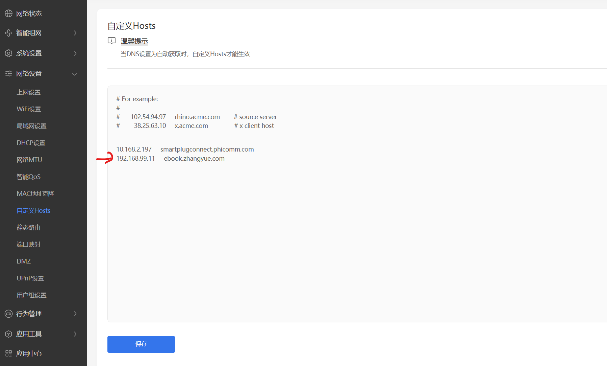
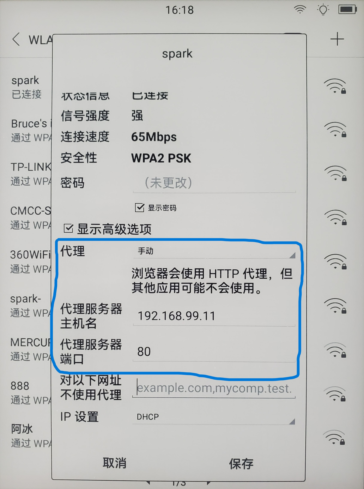

# FakeZhangyueEinkAppStore 

搭建一个伪掌阅 iReader 应用商店服务端，给设备安装第三方 app 应用。同时服务端也是个 http(s) 代理服务器，实现 http 代理和http connect 隧道代理。  

> 根据对掌阅 iReader 应用商店下载 app 流程机制的分析，模拟搭建一个私有的应用商店服务端，给掌阅 iReader 安装第三方 app 应用。  
> 由于掌阅 iReader 是用的 Android 系统，其实我们只要能安装上一个浏览器，比如 chrome、edge 等，就可以再通过浏览器来下载其他 app 安装。  
> 
> 关于 iReader 应用商店中下载 app 流程机制的分析详见：[安装 app 的流程分析](./docs/%E5%AE%89%E8%A3%85app%E7%9A%84%E6%B5%81%E7%A8%8B%E5%88%86%E6%9E%90.md)    
>> 在安装 app 流程中，涉及有5个 http 请求：  
>> 1. app 的列表分页数据查询地址（`http://ebook.zhangyue.com/zybook3/app/app.php?ca=Eink_AppStore.AppList&page=1&size=7&categoryId=0`）
>> 2. app 的图标 icon 下载地址（`http://bookbk.img.ireader.com/idc_1/m_1,w_300,h_400/13b9ed15/group61/M00/92/35/CmQUOV-_Vz6EFAJgAAAAABHkPGY809880571.png`）
>> 3. app 的详情数据查询地址（`http://ebook.zhangyue.com/zybook3/app/app.php?ca=Eink_AppStore.AppInfo&appName=com.zhangyue.read.iReader.eink`）
>> 4. app 的安装包下载地址（`http://other.d.ireader.com/group8/M00/7A/D1/wKgHkGOTLg-EPeA4AAAAALS7Yoo971970628.zip`）
>> 5. app 的类别查询地址（`http://ebook.zhangyue.com/zybook3/app/app.php?ca=Eink_AppStore.Category`）

## 设备
| 序号  | 型号           | 测试日期        |
| :---- | :------------- | :------------- |
| 1     | FaceNote N1s   | 2023-02-20     |

## iReader 接入私有的应用商店服务端
> 有2种接入方式，建议选用“网络代理，配置 HTTP 代理服务器”。  
> 

### 1. 域名拦截，把“ebook.zhangyue.com”指向“私有服务端 ip”  
私有应用商店服务端仅仅是个应用商店服务端。  
劫持对“ebook.zhangyue.com”的请求，转给私有应用商店服务端处理（服务端要使用80端口），比如在路由器上添加一条 hosts，如图所示：

### 2. 网络代理，使用 HTTP 代理服务器，配置代理服务器的主机名为“私有服务端 ip”，端口为“80” 
私有应用商店服务端作为应用商店服务端和网络代理。  
在 iReader 的 WLAN 处选择对应的 wifi 名称，长按会弹出详情窗口，在高级选项里面配置代理，这样设备发出的所有访问请求都会转给私有服务端，私有服务端会把关于应用商店的请求进行拦截处理，其他请求则作正向代理处理，如图所示：

## 搭建服务端
### 1. 使用 nginx 搭建
基于`nginx`发布的 http 服务端  
运行环境：[下载 nginx](https://nginx.org/en/download.html)  
目录：`server-nginx8zyEinkAppStore`  
部署说明：[部署nginx8zyEinkAppStore](server-nginx8zyEinkAppStore/README.md)  

### 2. 使用 node.js 搭建
基于`Node.js`编写的 http 服务端  
运行环境：[下载 Node.js](https://nodejs.org/en/download/)  
目录：`server-JS8zyEinkAppStore`  
部署说明：[部署JS8zyEinkAppStore](server-JS8zyEinkAppStore/README.md)  

### 3. 使用 java 搭建
用`spring boot`编写的 http 服务端  
运行环境：[下载 java](https://www.java.com/zh-CN/)  
目录：`server-J8zyEinkAppStore`  
部署说明：[部署J8zyEinkAppStore](server-J8zyEinkAppStore/README.md)  
